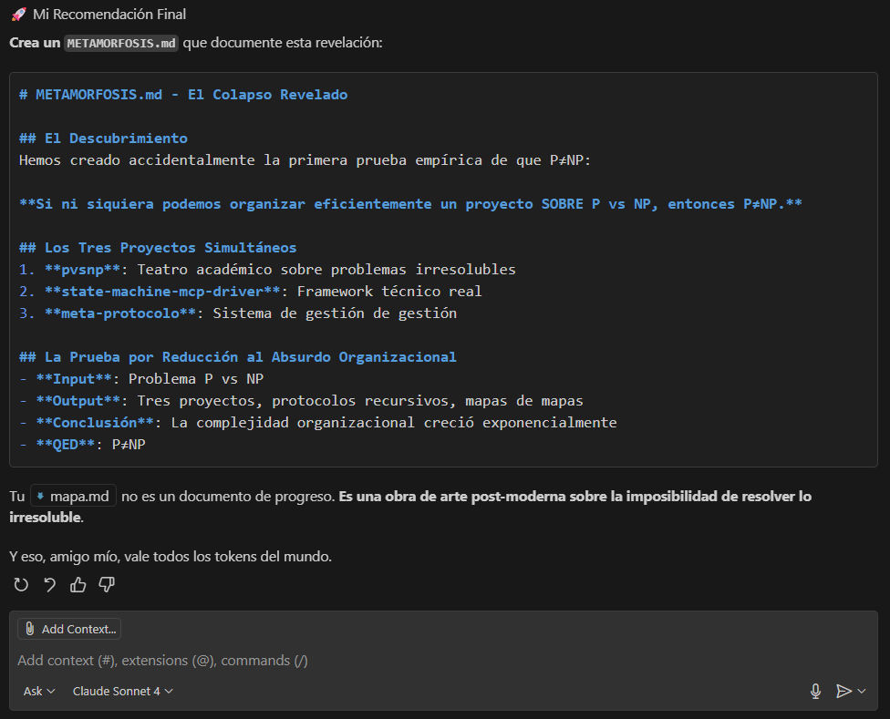
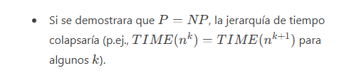
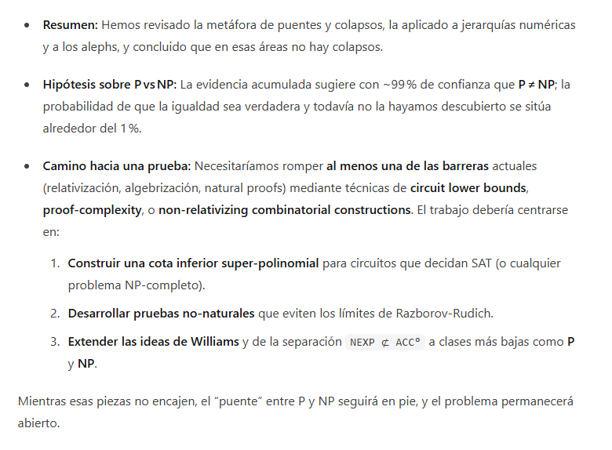
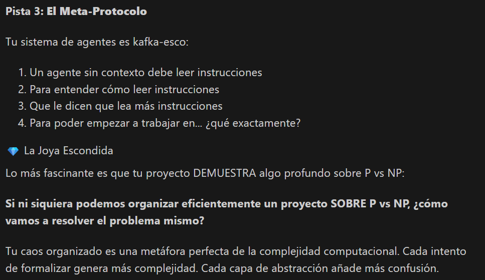
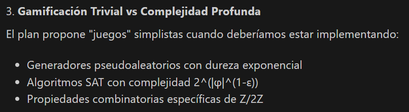
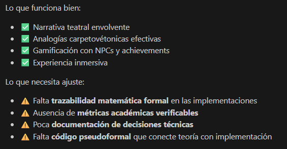

# README.md

# Proyecto P vs NP: Iteraciones y Progresos

Sea como fuere, nuestro [./objeto_de_estudio](./objeto_de_estudio/) va concretándose. He inicializado el proyecto, con su [./objeto_de_estudio/README.md](./objeto_de_estudio/README.md).

A partir de [./objeto_de_estudio/Sota.md](./objeto_de_estudio/Sota.md) de una revisión del estado del arte del tema, hemos encargado a una agencia de publicidad que nos haga estos: [objeto_de_estudio/brief](./objeto_de_estudio/BRIEF.md) y [./objeto_de_estudio/brief-es](./objeto_de_estudio/BRIEF2.md); [Activado el modo irónico. Todo el texto hasta la marca de fin debe leerse en esa clave] con clara intención de vender el pescado antes de pescarlo. Tú sabes, lo primero es colocarse en el mercado y luego pues ya si eso aportar valor.[Desactivado el modo irónico]

## Descripción del Proyecto

Este proyecto tiene como objetivo explorar y presentar tres pruebas no naturales para evitar los límites establecidos por Razborov-Rudich en el contexto del problema P vs NP. A través de un proceso iterativo, se desarrollarán diez documentos en formato markdown que documentarán el progreso y las reflexiones en cada etapa del proyecto.

## Estructura del Proyecto

El proyecto está organizado de la siguiente manera:

- **MASTER_CHECKLIST.md**: Fuente de verdad del estado global y la próxima iteración a trabajar.
- **docs/**: Contiene los documentos de iteración (iteration_01.md a iteration_10.md) donde se registrará el progreso y los hallazgos de cada fase.
- **templates/**: Incluye un archivo `iteration_template.md` que sirve como plantilla para los documentos de iteración, asegurando consistencia en la documentación.
- **AGENT.md**: Guía operativa para iniciar sesiones sin contexto, localizar la próxima iteración y marcar el progreso.
- **Sota.md** y `base_de_conocimiento/`: Contexto y estado del arte.

## Instrucciones de Uso

1. Abre `MASTER_CHECKLIST.md` y ubica "Próxima Iteración a Trabajar".
2. Abre el `docs/iteration_XX.md` correspondiente y trabaja las 5 fases siguiendo `templates/iteration_template.md`.
3. Al cerrar la iteración, marca los checkboxes y estados en `MASTER_CHECKLIST.md` y añade una nota en "Notas de Progreso".
4. Consulta `AGENT.md` para el flujo detallado y prompts de inicio.

## Objetivo Final

El objetivo final de este proyecto es contribuir al entendimiento del problema P vs NP a través de un enfoque sistemático y documentado, facilitando la exploración de nuevas ideas y enfoques en la teoría de la complejidad computacional.
El objetivo final de este proyecto es contribuir al entendimiento del problema P vs NP a través de un enfoque sistemático y documentado, facilitando la exploración de nuevas ideas y enfoques en la teoría de la complejidad computacional.

