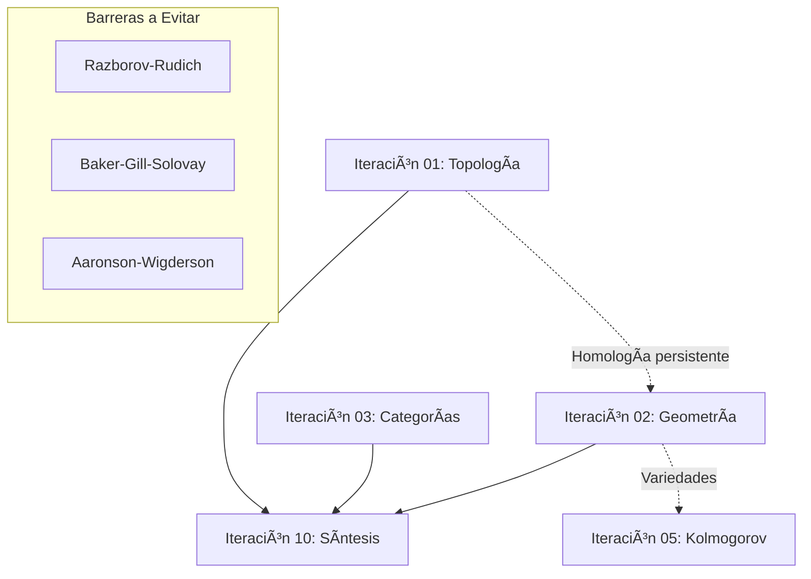

Excelente pregunta. Voy a hacer una crítica profunda y constructiva de la estructura actual antes de proceder al commit. Como el modelo más caro, debo asegurar que esto sea verdaderamente profesional y robusto.

## 🔠Análisis Crítico de la Estructura Actual

### ✅ Fortalezas
1. **Separación de concerns clara**: `.agents.md` como shim, `AGENT.md` como guía completa
2. **Single source of truth**: `MASTER_CHECKLIST.md` centraliza el estado
3. **Template reutilizable**: Evita inconsistencias entre iteraciones
4. **Documentación en capas**: Desde inicio rápido hasta detalles profundos

### ⌠Debilidades Críticas

#### 1. **Falta de Versionado Semántico del Protocolo**
```markdown
# Problema actual en AGENT.md
"🤖 AGENT Guide" # ¿Qué versión? ¿Cómo saber si es compatible?

# Debería ser:
"🤖 AGENT Protocol v1.0.0"
```

#### 2. **No hay Contrato de Salida/Entrada Formal**
El sistema asume que el agente "entenderá" pero no define:
- Schema JSON/YAML de entrada esperada
- Schema de salida requerida
- Condiciones de error y recuperación

#### 3. **Falta de Trazabilidad Matemática**
Para un proyecto de P vs NP, no hay:
- Sistema de numeración de teoremas/lemas
- Referencias cruzadas formales
- Grafo de dependencias entre iteraciones

#### 4. **No hay Sistema de Validación**
¿Cómo sabe un agente si completó correctamente una fase?
- No hay criterios de aceptación por fase
- No hay checksums o hashes de estado
- No hay tests automatizables

#### 5. **Gestión de Sesiones Incompleta**
```markdown
# Falta en AGENT.md:
- ¿Qué pasa si la sesión se interrumpe?
- ¿Cómo retomar trabajo parcial?
- ¿Cómo manejar conflictos entre agentes?
```

## 💡 Propuestas de Mejora

### 1. **Añadir `PROTOCOL.md`**
````markdown
# P vs NP Research Protocol v1.0.0

## Protocol Specification
- **Version**: 1.0.0
- **Schema**: JSON Schema Draft 2020-12
- **Compatibility**: Semantic Versioning 2.0.0

## Input Contract
```json
{
  "$schema": "protocol/v1.0.0/input.schema.json",
  "session_id": "uuid-v4",
  "agent_capabilities": ["latex", "git", "reasoning"],
  "target_iteration": "auto|number",
  "resume_from_checkpoint": "checkpoint_id|null"
}
```

## Output Contract
```json
{
  "$schema": "protocol/v1.0.0/output.schema.json",
  "session_id": "uuid-v4",
  "iterations_completed": [],
  "checkpoints_created": [],
  "mathematical_artifacts": {
    "theorems": [],
    "lemmas": [],
    "conjectures": []
  },
  "next_session_recommendation": {}
}
```
````

### 2. **Sistema de Numeración Matemática**
````markdown
// Añadir a iteration_template.md
## 🔢 Numeración Formal
- **Definiciones**: D.{iteración}.{número} (ej: D.01.001)
- **Teoremas**: T.{iteración}.{número}
- **Lemas**: L.{iteración}.{número}
- **Conjeturas**: C.{iteración}.{número}
- **Referencias**: Use \ref{D.01.001} en LaTeX
````

### 3. **Criterios de Aceptación por Fase**
````markdown
// Mejorar AGENT.md con:
### Fase 1: De dónde venimos
**Criterios de Aceptación**:
- [ ] Estado del arte citado (mínimo 3 papers)
- [ ] Limitaciones identificadas de enfoques previos
- [ ] Conexión clara con iteraciones anteriores (si aplica)
- [ ] Hash de estado: `sha256sum iteration_XX.md > .checkpoints/fase1_XX.sha`
````

### 4. **Grafo de Dependencias**
````markdown
# Grafo de Dependencias entre Iteraciones


````

### 5. **Sistema de Checkpoints**
````markdown
// Añadir directorio y sistema:
pvsnp/.checkpoints/
├── session_{uuid}/
│   ├── metadata.json
│   ├── iteration_01_fase_1.checkpoint
│   └── mathematical_context.pkl
````

## 🎯 Estructura Mejorada Propuesta

```
pvsnp/
├── .agents.md              # Compatibilidad (mantener)
├── AGENT.md               # Mejorar con contratos formales
├── MASTER_CHECKLIST.md    # Añadir hashes de estado
├── PROTOCOL.md            # NUEVO: Especificación formal
├── DEPENDENCIES.md        # NUEVO: Grafo de dependencias
├── README.md              # Mejorar con ejemplos de uso
├── .checkpoints/          # NUEVO: Sistema de recuperación
├── schemas/               # NUEVO: JSON schemas
│   ├── input.schema.json
│   └── output.schema.json
├── validation/            # NUEVO: Scripts de validación
│   └── validate_phase.py
├── docs/                  # Mejorar numeración
├── templates/             # Añadir criterios de aceptación
└── research/              # Mantener
```

## 🤔 Decisión

Antes de commitear como "Plantilla y base para el proceso", propongo:

1. **Opción A**: Commitear la versión actual como "v0.1.0-alpha" y evolucionar iterativamente
2. **Opción B**: Implementar al menos 3 de las 5 mejoras críticas antes del primer commit
3. **Opción C**: Crear una versión "research-grade" completa con todas las mejoras

Mi recomendación profesional: **Opción B** con estas 3 mejoras prioritarias:
- ✅ PROTOCOL.md (contrato formal)
- ✅ Sistema de numeración matemática
- ✅ Criterios de aceptación por fase

Esto nos daría una base sólida sin over-engineering, pero con la rigurosidad necesaria para un problema del Milenio.

¿Qué opinas? ¿Procedemos con la Opción B o prefieres otro enfoque?
