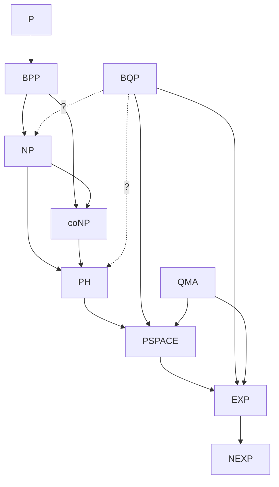

```mermaid
graph TD
  %% Clases clásicas
  P --> BPP
  BPP --> NP
  BPP --> coNP
  NP --> coNP
  NP --> PH
  coNP --> PH
  PH --> PSPACE
  PSPACE --> EXP
  EXP --> NEXP

  %% Clases cuánticas
  %% BQP ⊆ EXP (conocido)
  BQP --> EXP
  %% ¿BQP ⊆ NP? (desconocido)
  BQP -. ? .-> NP
  %% BQP ⊆ PSPACE (conocido)
  BQP --> PSPACE
  %% ¿BQP ⊆ PH? (desconocido)
  BQP -. ? .-> PH

  %% Otros
  %% QMA ⊆ PSPACE (conocido)
  QMA --> PSPACE
  %% QMA ⊆ EXP (conocido)
  QMA --> EXP

```