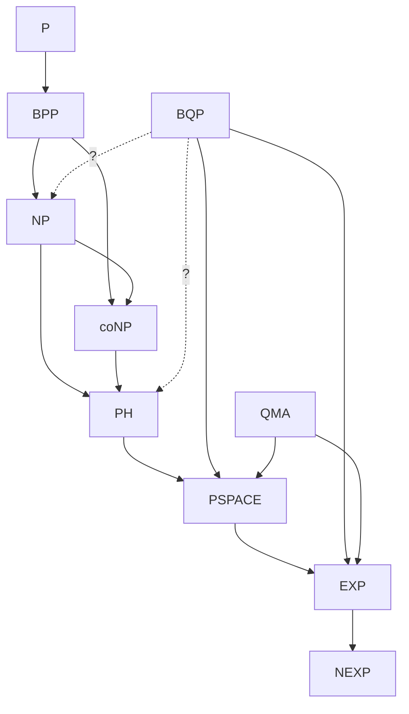

A ver un diagrama de todos los dominios , p, np...

edit

### Thought for 2.7 seconds

Diagrama de los dominios clásicos y cuánticos de complejidad
------------------------------------------------------------

> Nota\
> El diagrama se basa en la jerarquía *conocida* (o "propuesta") de clases de complejidad.\
> Los "incluidos" se muestran con flechas; las relaciones *probables* se indican con texto en paréntesis.\
> Las preguntas abiertas (P vs NP, BQP vs NP, etc.) se anotan con signos de interrogación.

### Descripción de los nodos

| Clase | Símbolo | Definición breve | Inclusiones conocidas | Relación con P / NP |
| --- | --- | --- | --- | --- |
| P | PP | Problemas decidibles en tiempo polinomial por una máquina determinista clásica. | P⊆BPPP⊆BPP. | Se pregunta si P=NPP=NP. |
| BPP | BPPBPP | Algoritmos probabilísticos con error <1/3<1/3 en tiempo polinomial. | P⊆BPP⊆NP∩coNPP⊆BPP⊆NP∩coNP. | Se cree que BPP=PBPP=P (p.e. por derandomización). |
| NP | NPNP | Problemas cuyas soluciones pueden verificarse en tiempo polinomial. | P⊆NPP⊆NP, NP⊆PHNP⊆PH. | Pregunta principal: P=?NPP=?NP. |
| coNP | coNPcoNP | Problemas cuyos *negativos* pueden verificarse en tiempo polinomial. | P⊆coNP⊆PHP⊆coNP⊆PH. | Se desconoce si coNP=NPcoNP=NP. |
| PH | PHPH | Unión de todos los niveles de la jerarquía polinomial (ΣkpΣkp​ y ΠkpΠkp​). | PHPH es la unión creciente de NPNP y coNPcoNP. | Si P=NPP=NP entonces PH=PPH=P. |
| PSPACE | PSPACEPSPACE | Problemas decidibles en espacio polinomial (pueden requerir tiempo exponencial). | PH⊆PSPACE⊆EXPPH⊆PSPACE⊆EXP. | Se sospecha NP⊆PSPACENP⊆PSPACE. |
| EXP | EXPEXP | Problemas decidibles en tiempo exponencial. | PSPACE⊆EXP⊆NEXPPSPACE⊆EXP⊆NEXP. | BQP y QMA están dentro de EXP. |
| NEXP | NEXPNEXP | Problemas decidibles en tiempo exponencial por una máquina no determinista. | EXP⊆NEXPEXP⊆NEXP. | Se cree que NEXPNEXP es más grande que EXPEXP. |
| BQP | BQPBQP | Problemas resolubles en tiempo polinomial por una máquina cuántica. | BQP⊆EXPBQP⊆EXP, BQP⊆PSPACEBQP⊆PSPACE. | Se desconoce su posición respecto a NPNP, PHPH. |
| QMA | QMAQMA | Cuasi‑polinomial analogía de NP en el modelo cuántico (verificador cuántico y prueba). | QMA⊆PSPACE⊆EXPQMA⊆PSPACE⊆EXP. | Se desconoce si QMA⊆NPQMA⊆NP. |

### Preguntas abiertas

| Pregunta | ¿Qué se sabe? | Relación con el diagrama |
| --- | --- | --- |
| P vs NP | Aún no resuelta. Si P=NPP=NP, la flecha P→NPP→NP se convertiría en una línea de igualdad. | La flecha P→NPP→NP lleva "¿". |
| BQP vs NP | Se conoce BQP⊆EXPBQP⊆EXP pero se desconoce si BQP⊆NPBQP⊆NP. | Flecha "BQP⊆?NPBQP⊆?​NP". |
| BPP vs P | Derandomización sugiere BPP=PBPP=P, pero no hay prueba definitiva. | Flecha "P=?BPPP=?BPP". |
| QMA vs NP | Se sabe QMA⊆PSPACEQMA⊆PSPACE, pero no se sabe si QMA⊆NPQMA⊆NP. | Flecha "QMA⊆?NPQMA⊆?​NP". |

> Resumen rápido
>
> 1.  Todos los problemas de P son de hecho "locales" en el sentido de que cada paso del algoritmo se procesa sobre bits que están físicamente disponibles en la misma RAM.
> 2.  NP y coNP comparten la idea de que la *verificación global* de una solución candidata implica leer (o comprobar) todas las variables de la entrada al mismo tiempo.
> 3.  Entrelazamiento cuántico ofrece una forma de correlación global (no‑local) que sitúa a BQP y QMA dentro de la jerarquía clásica, pero no rompe la barrera PP vs NPNP ni demuestra que NP=PNP=P.

Si deseas el diagrama en un formato visual (por ejemplo, una figura PDF/PNG), avísame y lo genero para ti.