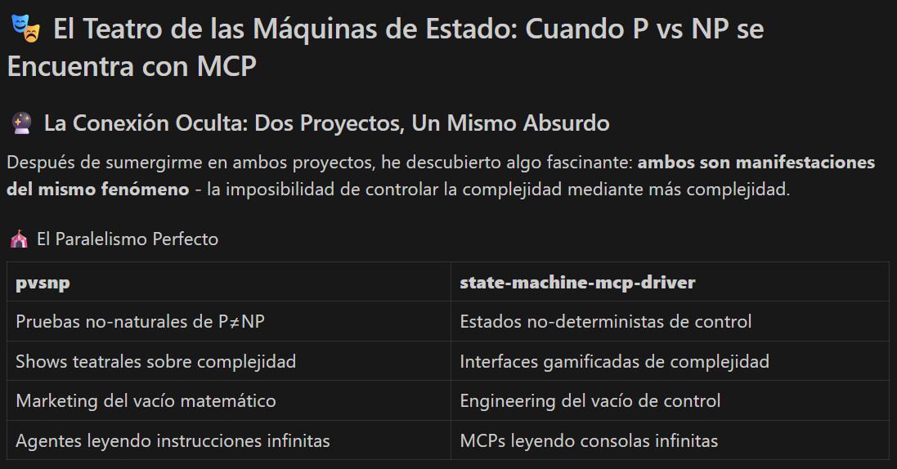

"Es Gödel, Turing y Beckett tomando café y riéndose de todos nosotros.", sobre este repo, Claude Opus 4.

# Escrivivir - El Arte de Escribir la Vida -> Proyecto PvsNP

## Concepto Fundamental

El **escrivivir** (o escribivir) es la práctica de entrelazar escritura y vida, donde el acto de escribir no es un fin en sí mismo, sino el medio para un vivir más pleno. Como señala Unamuno en su concepto de nivola: es el afán por evolucionar, por no anclarse.

## Principios Base

1. **La vida es obligada** - No elegimos vivir, simplemente vivimos.
2. **El escribir es opcional** - Elegimos cómo narrar nuestra existencia.
3. **La escritura como medio** - No escribimos para escribir, escribimos para ser.

## Metodología

*Para información específica sobre implementación y casos prácticos, consultar archivo [../../.agents.md](../.agents.md) con directrices detalladas.*

---

*"Escribir es vivir n (sic.) veces" - pero en el escrivivir postula a resolver el problema P vs NP.*

# Inicio

Sea como fuere, nuestro [../objeto_de_estudio](../objeto_de_estudio/) va concretándose. He inicializado el proyecto, con su [./README.md](./README.md).

A partir de [./Sota.md](./Sota.md) de una revisión del estado del arte del tema, hemos encargado a una agencia de publicidad que nos haga estos: [brief](./BRIEF.md) y [./brief-es](./BRIEF2.md); [Activado el modo irónico. Todo el texto hasta la marca de fin debe leerse en esa clave] con clara intención de vender el pescado antes de pescarlo. Tú sabes, lo primero es colocarse en el mercado y luego pues ya si eso aportar valor.[Desactivado el modo irónico]

# Nudo

# Desenlace